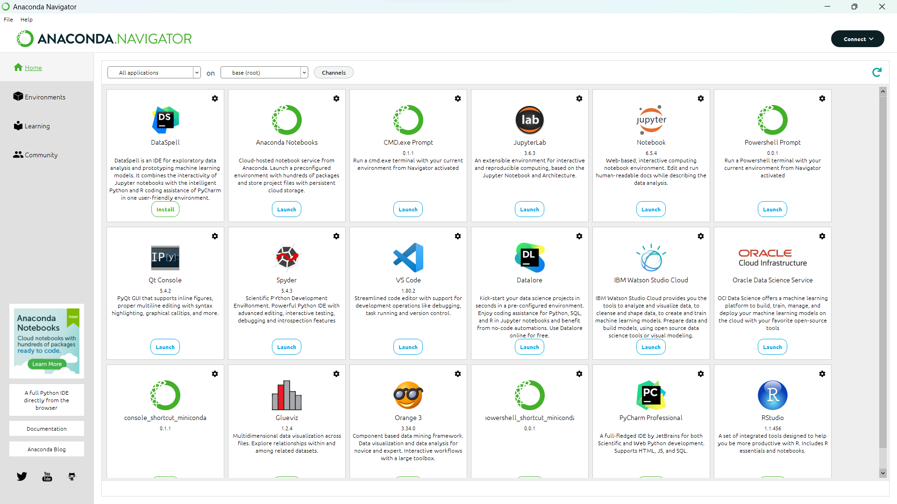
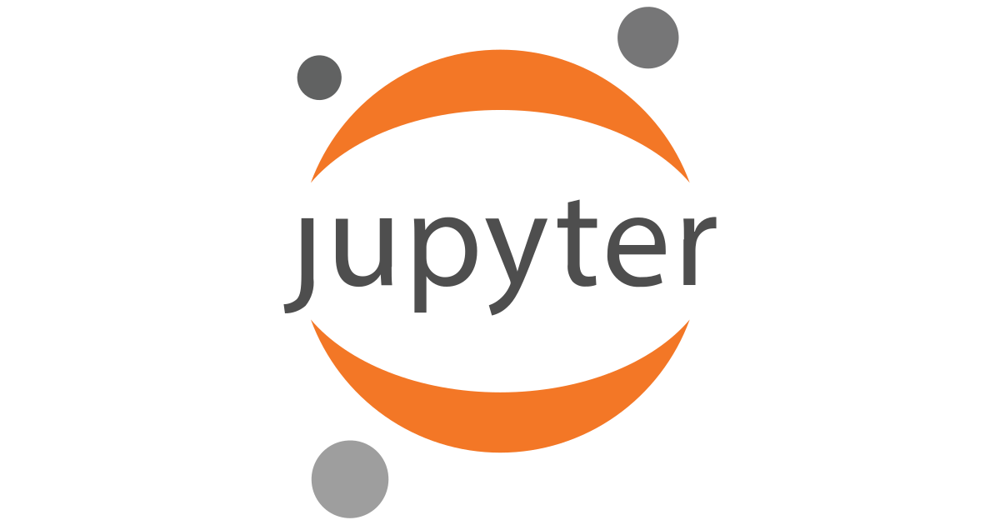
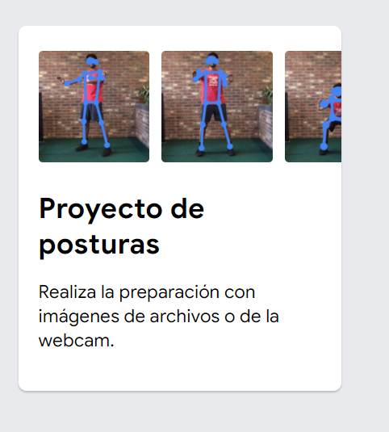

<h5>Capítulo III</h5>

Anaconda es una distribución gratuita y de código abierto de los lenguajes de programación Python. Está especialmente diseñada para ser utilizada en ciencia de datos, análisis de datos y aprendizaje automático. Anaconda proporciona un entorno completo que incluye herramientas y bibliotecas útiles para el procesamiento de grandes cantidades de datos, análisis predictivo y cómputos científicos. 

Jupyter es el Jupyter Notebook, que es una aplicación web interactiva que permite crear y compartir documentos llamados "notebooks". Estos notebooks contienen celdas de código, texto enriquecido, imágenes y elementos multimedia, lo que los hace ideales para la narración de proyectos, análisis de datos y presentación de resultados.

 Jupyter ha ganado mucha popularidad en el campo de la ciencia de datos, la investigación y la educación debido a su enfoque interactivo, lo que lo convierte en una herramienta poderosa para explorar datos, realizar análisis complejos y comunicar resultados de manera efectiva. 

Pandas es una biblioteca de código abierto de Python que proporciona estructuras de datos y herramientas de análisis de datos de alto rendimiento. Es ampliamente utilizada en el campo de la ciencia de datos, análisis de datos y manipulación de datos en Python.

<h1>Teachable Machine</h1>

Es una plataforma en línea desarrollada por Google que permite a las personas, incluso sin experiencia en programación, crear modelos de aprendizaje automático (machine learning) de manera interactiva y visual.Es una herramienta educativa y accesible para que cualquier persona pueda experimentar con el aprendizaje automático de manera fácil y divertida.

<h5> La plataforma admite tres tipos principales de tareas:</h5>

- <h5>Clasificación de imágenes:</h5>

 Permite entrenar un modelo para clasificar imágenes en diferentes categorías. Los usuarios pueden tomar fotos o cargar imágenes en la plataforma y asignar etiquetas a cada categoría.

- <h5>Detección de objetos: </h5>
  
Los usuarios pueden crear modelos que detecten y localicen objetos específicos en imágenes o videos.

- <h5>Detección de sonidos:</h5>
  
Teachable Machine también permite entrenar modelos para reconocer diferentes sonidos y clasificarlos en categorías.

<h1>Snake-IA</h1>

