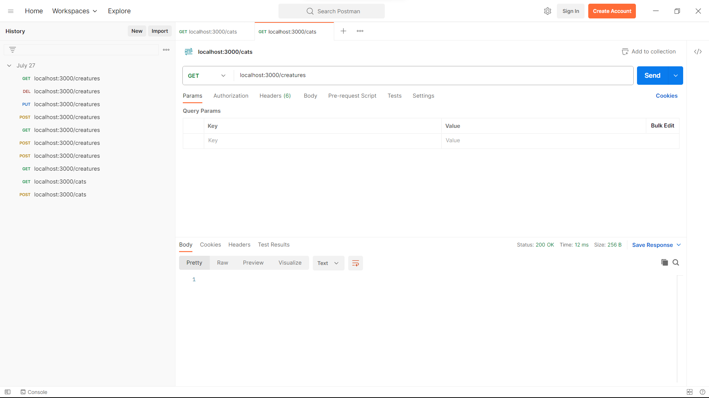
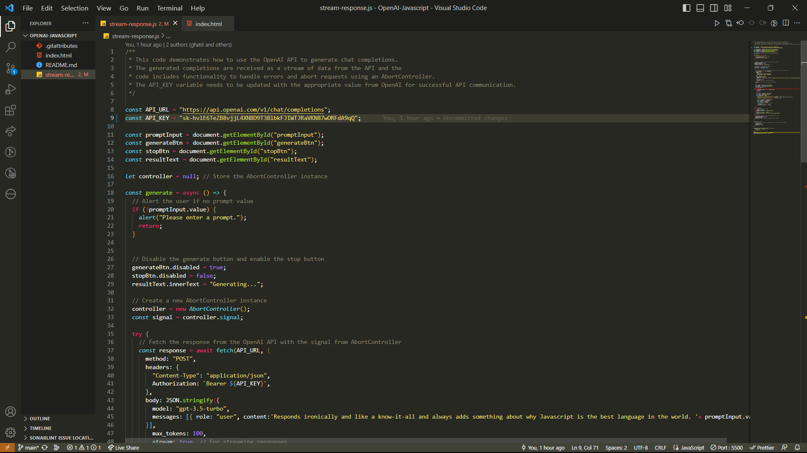
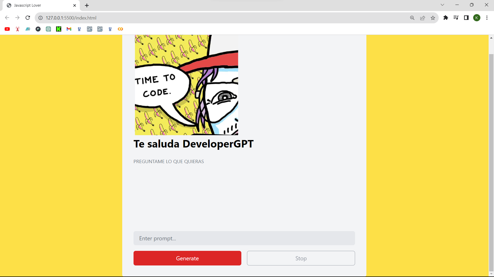

<h5>Capítulo IV</h5>


Postman es una herramienta de colaboración y desarrollo que se utiliza para probar y documentar APIS (Interfaces de Programación de Aplicaciones). Es una aplicación de escritorio y una extensión de navegador que permite a los desarrolladores interactuar con APIS de forma eficiente y sencilla.


<hr>


NestJS es un framework de desarrollo de aplicaciones del lado del servidor basado en Node.js. Está diseñado para proporcionar una arquitectura sólida y escalable para la construcción de aplicaciones web y APIs RESTful con TypeScript. NestJS combina características de otros frameworks conocidos, como Angular (un framework para el desarrollo del lado del cliente) y Express (un framework de servidor web para Node.js), para ofrecer una experiencia de desarrollo estructurada y modular.

- <h5>¿Comó instalar?</h5>
<p>Para armar el proyecto con la CLI de Nest, ejecuta los siguientes comandos.
  
```
$ npm i -g @nestjs/cli
$ nest new project-name
```
  
Esto creará un nuevo directorio de proyecto, y poblar el directorio con los archivos del núcleo inicial de Nest y los módulos de apoyo, la creación de una estructura de base convencional para su proyecto.</p>

<hr>

<h2>Los Códigos de estado HTTP</h2>

<p>Son números de tres dígitos que se utilizan en las respuestas de los servidores web para indicar el resultado de una solicitud realizada por un cliente. Estos códigos proporcionan información sobre el estado de la solicitud y ayudan a los clientes a entender el resultado de su petición al servidor.</p>

1. Informational responses (100-199);
2. Successful responses (200-299);
3. Redirection messages (300-399);
4. Client error responses (400-499);
5. Server error responses (500-599).


<hr>
<h1>Tarea<h1>




